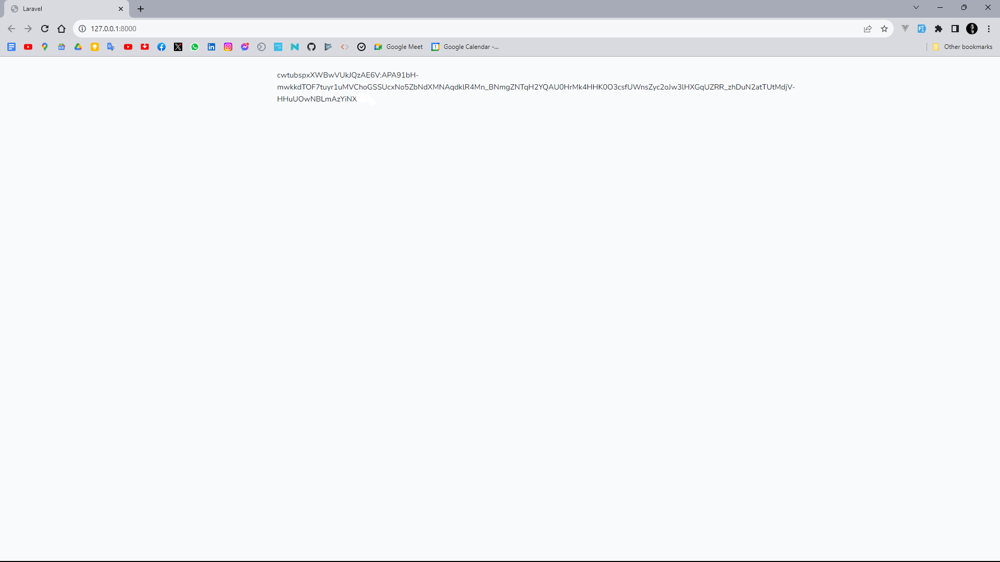

# Generate the FCM token

## 1. Add the server key to the .env file

```
FCM_SERVER_KEY=XXXXXXXXXXXXXXXXXXXXXXXXXXXXXXXXXXXXXXXXXXXXXX

FIREBASE_API_KEY=
FIREBASE_PROJECT_ID=
FIREBASE_MESSAGING_SENDER_ID=
FIREBASE_MEASUREMENT_ID=
FIREBASE_APP_ID=
```

## 2. Install the dependencies

```bash 
composer install
npm install
vite build
```

## 3. Run the appplication to generate the FCM token

```bash
php artisan serve
```

## 4. Screenshot



